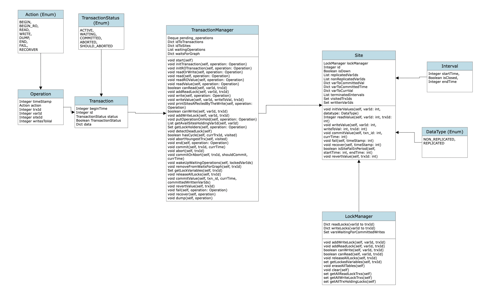

# Documentation and Code Structure - RepCRec

This project is a course project of Advanced Database System (CSCI-GA.2434-001) in New York University, Fall 2022, taught by Professor Dennis Shaha.

We implement a tiny distributed database and complete multi-version concurrency control, deadlock detection, replication, and failure recovery.

## Team Members
 
 - Shang-Chuan Liu (sl9413@nyu.edu)
 - Siwei Liu (sl9386@nyu.edu)


## Programming Language

Python

## Design Graph



## Algorithm

* We implement the **available copies approach** to replication by using **strict two phase locking** (using read and write locks) at each site and validation at commit time.
* At each variable locks are acquired in a **first-come first-serve** fashion.
* We use **cycle detection** to detect deadlocks and implement it by using depth-first search.
* For the victim selection algorithm, we choose **the youngest transaction** in the cycle to abort.
* We use **multi-version read consistency** for Read-only transactions.
* We ensure that write starvation will not happen.
  For example, if x is currently read-locked by T1, and T3 is waiting for a write lock on x. If T2 subsequently requests a read lock on x, T2 must wait for T3 either to be aborted or to complete its possesion of x. That is to say, T2 cannot skip T3.

## Major Modules

### `TransactionManager`

> Author: Shang-Chuan Liu, Siwei Liu
> Translates operations on variables of sites by transactions using the available copy algorithm.

### `Site`

> Author: Shang-Chuan Liu, Siwei Liu
> Perform recovery when the site fails.
> Manage replicated variables and non-replicated varivable of the sites.

### `LockManager`

> Author: Shang-Chuan Liu, Siwei Liu
> Perform locks
> Manage read locks and write locks of each sites.

## How To Run

* run test1 ~ test24 in the `inputs` directory
    * use this command: `./runit.sh`
    * output files will be generated in the `outputs` directory

* run certain test
    * use this command: `java -jar RepCRec.jar ./inputs/test1.txt`
    * output file `test1.txt_out` will be generated in the `outputs` directory

* unzip and run reprounzip file
    * use this command to unzip: `./reprounzip directory setup RepCRec.rpz ~/yourDesiredDirectoryName`
    * use this command to run: `./reprounzip directory run ~/yourDesiredDirectoryName`
    * it will run test1 ~ test24 in the `inputs` directory
    * output files will be generated in the `outputs` directory


## Testing Scripts

* test4 in `inputs/test4.txt`

```
begin(T1)
begin(T2)
R(T1,x3)
    > T1 add read lock on x3 of site 4
W(T2,x8,88)
    > T2 add write lock on x8 of all sites
fail(2)
    > cause T2 abort when it ends because x8 is on site 2 and T2 accessed it
    > relase all locks on site 2
R(T2,x3)
    > T2 cannot be executed because it will abort when it ends
W(T1,x4,91)
    > T1 add write lock on x4 of site 1, 3, 4, 5, 6, 7, 8, 9, 10
recover(2)
    > activate site 2
    > replicated variables on site 2 cannot be read until committed write takes place on them
end(T2)
    > T2 aborts because site 2's fail
end(T1)
    > T1 commits, so x4 of site 1, 3, 4, 5, 6, 7, 8, 9, 10 is updated to 91
dump()
    > x4: 91 at site 1, 3, 4, 5, 6, 7, 8, 9, 10
    > All other variables have their initial values
```

* test8 in `inputs/test8.txt`

```
begin(T1)
begin(T2)
fail(3)
fail(4)
R(T1,x1)
    > T1 add read lock on x1 of site 2
W(T2,x8,88)
    > T2 add write lock on x8 of site 1, 2, 5, 6, 7, 8, 9, 10
end(T1)
    > T1 commits and releases all locks it caused
recover(4)
    > activate site 4
    > replicated variables on site 4 cannot be read until committed write takes place on them
recover(3)
    > activate site 3
    > replicated variables on site 3 cannot be read until committed write takes place on them
R(T2,x3)
    > T2 add read lock on x3 of site 4
    > because site 4 is recovered and x3 is non-replicated data, so T2 can read it
end(T2)
    > T2 commits, so x8 is updated to 88 on site 1, 2, 5, 6, 7, 8, 9, 10
    > releases all locks it caused
dump()
    > x8: 88 at site 1, 2, 5, 6, 7, 8, 9, 10
    > All other variables have their initial values
```

* test10 in `inputs/test10.txt`

```
begin(T1)
beginRO(T2)
    > keep all the last commited variables of available sites for non-replicated data and that of site which is active from last committed time till now for replicated data
    > keep all variables with their initial values
R(T2,x1)
    > T2 read the data it kept when it begins, so x1 is 10
R(T2,x2)
    > T2 read the data it kept when it begins, so x2 is 20
W(T1,x3,33)
    > add write lock to x3 of site 4
end(T1)
    > T1 commits, so x3 of site 4 is updated to 33
    > released all locks caused by T1
beginRO(T3)
    > keep all the last commited variables of available sites for non-replicated data and that of site which is active from last committed time till now for replicated data
    > keep x3 with value 33 and all other variables with their initial values
R(T3,x3)
    > T3 read the data it kept when it begins, so x3 is 33
R(T2,x3)
    > T2 read the data it kept when it begins, so x3 is 30
end(T2)
    > T2 commits
end(T3)
    > T3 commits
dump()
    > x3: 33 at site 4
    > All other variables have their initial values
```

* test17 in `inputs/test17.txt`

```
begin(T5)
begin(T4)
begin(T3)
begin(T2)
begin(T1)
W(T1,x4, 5)
    > add write lock on x4 of all sites
fail(2)
    > cause T1 abort when it ends because x4 is on site 2 and T1 accessed it
    > relase all locks on site 2
W(T2,x4,44)
    > T2 should wait until T1 ends and releases write lock on x4 of site 1,3,4,5,6,7,8,9,10
recover(2)
    > activate site 2
    > replicated variables on site 2 cannot be read until committed write takes place on them
W(T3,x4,55)
    > T3 should wait until T1 ends and releases write lock on x4 of site 1,3,4,5,6,7,8,9,10
W(T4,x4,66)
    > T4 should wait until T1 ends and releases write lock on x4 of site 1,3,4,5,6,7,8,9,10
W(T5,x4,77)
    > T5 should wait until T1 ends and releases write lock on x4 of site 1,3,4,5,6,7,8,9,10
end(T1)
    > T1 aborts because site 2's fail
    > release all locks T1 caused, so W(T2,x4,44) can be executed
    > T3, T4, T5 should wait until T2 ends and releases write lock on x4 of all sites
end(T2)
    > T2 commits, so x4 of all sites is updated to 44
    > release all locks T2 caused, so W(T3,x4,55) can be executed
    > T4, T5 should wait until T3 ends and releases write lock on x4 of all sites
end(T3)
    > T3 commits, so x4 of all sites is updated to 55
    > release all locks T3 caused, so W(T4,x4,66) can be executed
    > T5 should wait until T4 ends and releases write lock on x4 of all sites
end(T4)
    > T4 commits, so x4 of all sites is updated to 66
    > release all locks T4 caused, so W(T5,x4,77) can be executed
end(T5)
    > T5 commits, so x4 of all sites is updated to 77
    > release all locks T4 caused
dump()
    > x4: 77 at all sites
    > All other variables have their initial values
```

* test23 in `inputs/test23.txt`

```
begin(T1)
begin(T2)
R(T2, x2)
    > T2 add read lock on x2 of all sites 
W(T1, x2, 202)
    > T1 should wait until T2 ends and releases its read lock on x2 on all sites
W(T2, x2, 302)
    > T2 cannot promote its read lock to a write lock because it cannot skip T1's write operation, so T2 should wait until T1 ends
    > deadlock happened! T2 is younger, so abort T2 and release all lock T2 caused
    > W(T1, x2, 202) can be executed
end(T1)
    > T1 commits, so x2 of all sites is updated to 202
    > release all locks T1 caused
dump()
    > x2: 202 at all sites
    > All other variables have their initial values
```